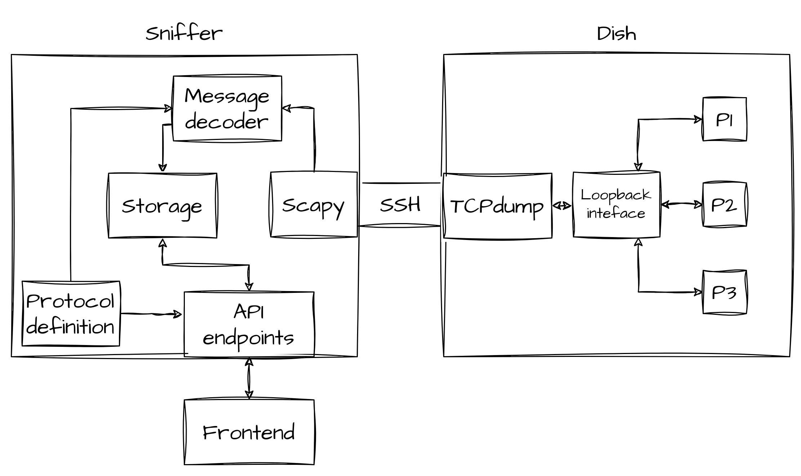
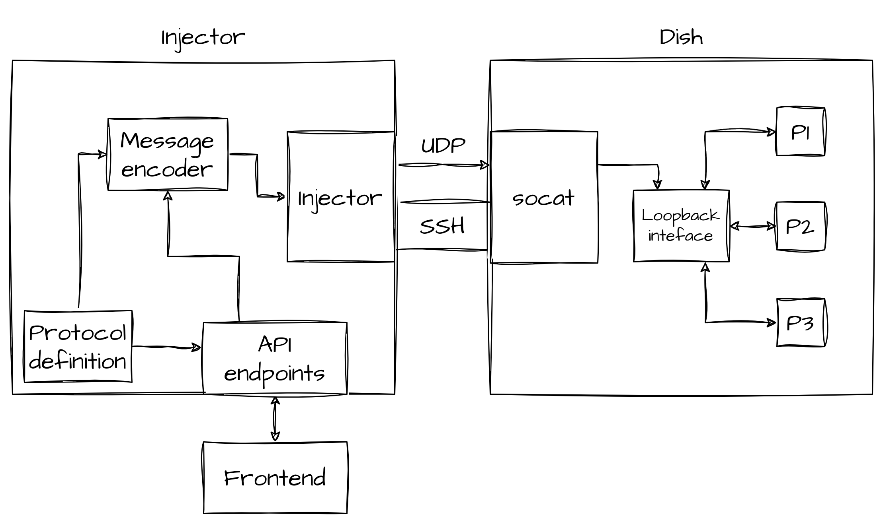
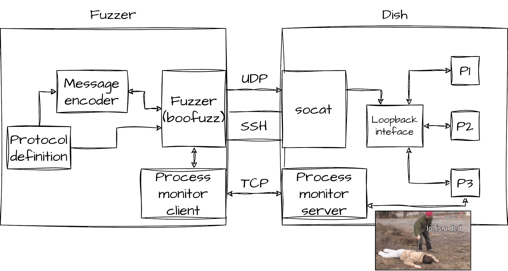

# Slate sniffer, injector and fuzzer

The Slate sniffer is a tool that can sniff and decode IPC messages exchanged between processes in the User Terminal.
The Slate injector is the part that lets you inject custom-crafted messages.
Finally, the Slate Fuzzer is a black-box fuzzing tool for the protocol, that uses Boofuzz.

The purpose and usage of this tool are better explained in the linked [blog post](https://blog.quarkslab.com/starlink.html).

## Setting up the tool

To set up this tool you will need some files from the dish, so if you did not extract the firmware from the eMMC stop here and [do it](https://www.esat.kuleuven.be/cosic/blog/dumping-and-extracting-the-spacex-starlink-user-terminal-firmware/).

### Dependencies

The software dependencies for these tools are just `python >= 3.11` and some python packages listed in `requirements.txt` which can be easily installed with

```bash
python3 -m pip install -r requirements.txt
```

Then, the tool will make use of some programs on the dish, that should be preinstalled (at least they were on the version I worked on), if they are not, please install them on the dish:

* ssh (server)
* tcpdump
* socat
* micropython 3 (or python 3)

### Dish set up

To be able to work with the dish, you will need a **development** dish, if you don't, there is no need to worry, you can make it think it is :)

1. Enable SSH password access and set the root password
2. Disable packet filtering rules on the internal interface

These steps can be done by using the script [dish-setup.sh](./dish-setup.sh), but you will need some sort of SSH access (through a Yubikey, perhaps).

### Firmware files integration

After installing the required dependencies you will need to copy some files from the dish's firmware.
All of the needed files are in the `sx` partition, also called `sx runtime`, you can use [this script](../parts-extractor/parts-extractor.py) to extract the partitions from the raw disk image and then the following command line can extract the filesystem contained in the `sxverity` image (see the [blog post](https://blog.quarkslab.com/starlink.html) to understand what is going on).

```bash
# Extract the inner rom1fs filesystem
dd if=/path/to/sxverity/image of=/path/to/output/file bs=1M skip=$((0x1000))B status=progress

# mount the filesystem
mount -o loop /path/to/the/filesystem /path/to/the/mount/point
```

After doing that you should find a compressed tarball where the filesystem was mounted, extract the content somewhere and prepare to copy some files.

Inside the directory `dat/common`

* copy all slate-related files to the folder of this project named `config/data_format`. Such files are in the form `[p1]_to_[p2]` where `p1` and `p2` are names of processes (e.g. `control_to_frontend`)
* copy also version-specific slate definitions, which can be found in `dat/board_rev_[BOARD_REVISION]` (e.g. `board_rev_rev2_proto3`)
* copy the services configuration (`service_directory`) to `config`

After doing all this, you can generate the json file by using the `generate_service_json.py` and putting it into `config/service_directory.json`

This should be enough for the sniffer and injector to work, whereas, for the fuzzer, some more actions are needed.

In `config/service_directory.json`:

* fill manually the names of processes (`sender` and `receiver`)
* by using the sniffer, gather the Crc values (decimal) for each couple of processes and fill them into the `crc` fields

As an example, for the service `control_to_frontend`:

```json
"control_to_frontend": {
    "host": "localhost",
    "port": 6500,
    "sender": "user_terminal_control",
    "receiver": "user_terminal_frontend",
    "crc": 3165258159
},
```

At this point also the fuzzer should work, but when a process crashed, it won't know how to restart it.
To fix this, create a file in `config`, named `process_info.json`, containing the following information of each process:

* `cwd`: the working directory in which the process should be started (usually `/sx/local/runtime`)
* `run`: the command line used to start the process, with its arguments

As an example, here is the one for the `user_terminal_frontend`:

```json
{
    "user_terminal_frontend": {
        "cwd": "/sx/local/runtime",
        "run": "/sx/local/runtime/bin/user_terminal_frontend"
    },
    ...
}
```

You can find this information by looking at how the processes are started from the init script or by dynamically looking for the same thing (e.g. `cat /proc/<pid>/cmdline`)

## Starting the tools

Here is how you can use the tools included in this project.
For more information about how to use these scripts, use the `-h` command line argument.

### Slate sniffer & injector

To start the slate sniffer/injector, you just need to run:

```
python server.py
```

And visit `http://localhost:5000`, or directly interact with the APIs exposed on the same URL.

### Slate fuzzer

To start the fuzzer, you can run

```
python fuzzer.py [SERVICE_NAME]
```

e.g.

```
python fuzzer.py control_to_frontend
```

## Project architecture

For a more detailed description of the project, please head to the [blog post](https://blog.quarkslab.com/starlink.html), but here is a quick overview.

The tools in this project share most of the code, which is at the base of them, such as the message decoder/encoder.

For the slate sniffer, here is the architecture:



As you can see, the project has been made as modular as possible, so that anyone can replace a module with ease.

As an example, my frontend is pretty basic (and pretty slow), but thanks to the simple API endpoints the tool exposes, it is easy to completely replace the frontend with some more complex dashboards to present the data in better ways.

`TCPdump`, running on the dish, and started through SSH, captures packets on the loopback interface of the dish, by filtering only UDP traffic with the given destination ports (given by the `service_directory.json` file).
Then, raw packets are parsed by `scapy` which identifies the service from the destination port and extracts the UDP payload of the message.
It also reconstructs fragmented messages in this phase.
Then, the content of the message is decoded by the message decoder (using the protocol definitions) and stored by the Storage component, which in this case is a simple in-memory dictionary.
After that, API endpoints can be used to fetch messages and message structures by the front-end.

The slate injector, which is part of the same tool as the sniffer, has a very similar architecture:



The main difference in this is that the message decoder has become a message encoder and instead of having `tcpdump` on the dish, there is a `socat` server that listens for UDP datagrams on an external interface and forwards them to the right process, through the loopback interface, by changing the source address to localhost and the destination port to the one the process is listening on.

Finally the architecture of the fuzzer is once again very similar to the one of the injector:



In this case the main differences are:

* the fuzzer, which is [`boofuzz`](https://boofuzz.readthedocs.io/en/stable/) and generates messages starting from the protocol definition
* the process monitor, which is split into two parts, one runs on the server and checks if a process is still alive, and the other one directly interacts with the fuzzer, who asks whether a process is still alive every time a message is sent.